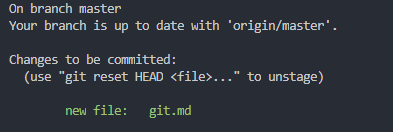
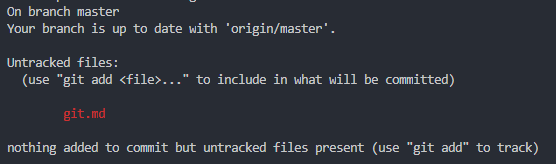
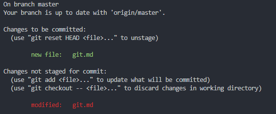

Basic git command!

### git克隆

+ 使用ssh进行克隆
    > git clone git@github.com:owener/xxx.git
+ 使用https进行克隆
    > git clone <https://github.com/sfdan473414/handnote.git>

### git克隆指定的分支

  > git clone -b {branch-name} {git-address}  

    example: git clone -b handnote-python https://github.com/sfdan473414/handnote.git  

    example: git clone -b handnote-python git@github.com:sfdan473414/handnote.git  

### git克隆重命名

> git clone <https://github.com/sfdan473414/handnote.git> new_name

### 查看当前分支文件或目录的状态

  > git status  

在进行查看status状态之前，需要先了解下git的状态转移情形。

untracked: 表示文件还未被追踪.  
unmodified: 表示文件未被修改.  
modified: 对unmodified状态的文件进行修改，变成了该状态..  
staged : 表示文件处于暂存状态，还未提交.  
在当前的分支执行：<code>  git status  </code>  
  
如果看到了`Untracked files:`字样，表示以下文件还未被追踪。你可以使用`git add <file>`来添加进行追踪，使之变为个状态。  
执行命令：<code>  git add git.md  </code>  
然后执行命令：<code>  git status  </code>  
  
如果看到了`Changes to be committed:`字样，表示下列文件被追踪，且当前的状态为`staged`(暂存状态)。  
如果对暂存的文件进行修改`git.md`，再次执行命令:<code class="git">  git status  </code>  
 
  
这里你会看到文件状态，一个是已经进行了暂存但是还未提交`Changes to be committed:`，另一个是对暂存的文件进行了修改还未进行暂存`Changes not staged for commit:`, 如果此时执行提交命令`commit`,那么对于暂存的文件进行了修改还未进行暂存的文件内容不会被提交，仅仅提交了上一次暂存的文件内容。如果需要暂存文件，根据上述的命令提示执行`git add <file>`即可。此时的文件状态变为了`staged`(即标识符为`Changes to be committed:`状态).

### 提交文件或目录

> git commit -m "msg"

`-m "msg"`为可选的项目，如果不指定将采用配置中默认的文本编辑器来编辑提交信息。如果想要在某个分支下提交，则先要切换到指定分支再执行。

### 创建分支

> git branch \<branch-name\>

### 切换分支

> git checkout \<branch-name\>

### 创建分支并切换

> git checkout -b \<branch-name\>

### push推送

> git push \<remote-repo\> \<branch-name\>  
> example: git push origin handnote-python  
> example: git push  <https://github.com/sfdan473414/handnote.git> handnote-python  
使用push命令时需要指定远程仓库的地址和指定的分支。
