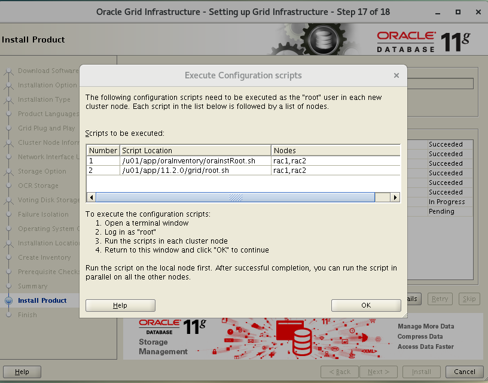
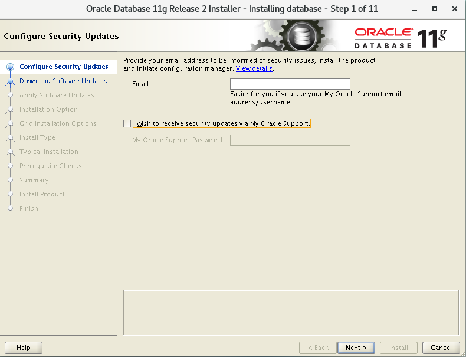
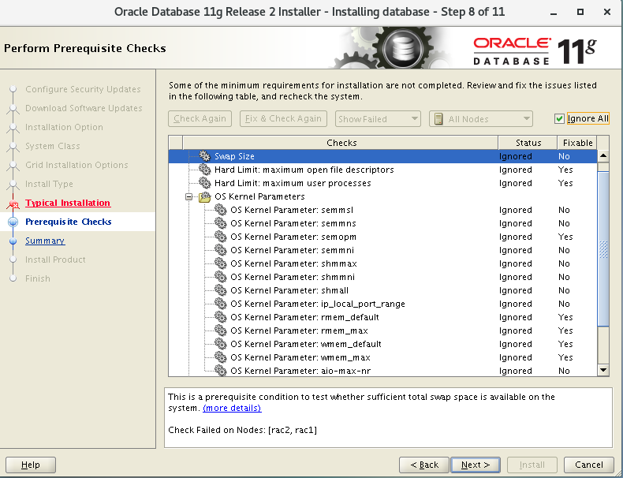

使用Vmware安装Oracle 11g r2 RAC。本安装仅在VMWare虚拟机中实践，真实物理机未测试。

所使用的软件版本：
|名称|版本|说明|
|:--:|:--:|:--:|
|VMware|Workstation14.x|
|Centos|Centos7-1810|x86_64|
|Oracle|11g realease 2.0.4.0|

# 安装前准备工作

## 1. 虚拟机安装及操作系统安装

   该部分可以在网上自行Google或者百度解决。

## 2. 新增网卡及配置

 为每一台RAC节点虚拟机新增一个网卡。**创建网卡主要是为了RAC集群中各个节点之间通过Private网络进行通信，而对外是通过Public网络进行访问的。如果已经满足条件可以跳过。**。

### 2.1 VMware创建网卡

 在新增网卡时建议先关闭虚拟机电脑，然后根据下图进行创建网络适配器：

 

 紧接着，选中 `新增的网络适配器`，可以根据自己的需要选择网络连接模式，这里选择的是**自定义->VMnet8(NAT)模式**. 使用NAT来搭建如下模式。 

 

 接下来要来创建`VMnet8`适配器.如下图所示：

 

需要更该权限才能进一步，如下图所示：点击“更改设置”


新增“VMnet8”网络适配器。如下图所示：


配置VMnet8适配器的子网地址，子网掩码要正确， 如下图所示：


配置VMnet8适配器的网关地址(可选),如下图所示：


点击完成，此时完成了网卡的添加。  

### 2.2 配置IP地址

接下来开启虚拟机，配置网卡的IP地址，打开终端，切换到root账号，约定`#root`开始的在root账号下执行命令,`#user`开始的在普通用户账号下执行命令。或者文中有提示使用什么用户进行操作。

<font color="red" align="center">**注意：两个虚拟机都需要配置第二个网卡.**</font>

Step1: 执行 `# ifconfig`,查看网卡的添加情况。其中`ens33`是原有的网卡，`ens37`为新增的网卡，如下所示：
<pre>ens33: flags=4163&lt;UP,BROADCAST,RUNNING,MULTICAST&gt;  mtu 1500
        inet 192.168.1.13  netmask 255.255.255.0  broadcast 192.168.1.255
        inet6 fe80::d302:c7e5:842f:2541  prefixlen 64  scopeid 0x20&lt;link&gt;
        ether 00:0c:29:8c:71:eb  txqueuelen 1000  (Ethernet)
        RX packets 230  bytes 24003 (23.4 KiB)
        RX errors 0  dropped 0  overruns 0  frame 0
        TX packets 347  bytes 29330 (28.6 KiB)
        TX errors 0  dropped 0 overruns 0  carrier 0  collisions 0

ens37: flags=4163&lt;UP,BROADCAST,RUNNING,MULTICAST&gt;  mtu 1500
        inet 192.168.2.13  netmask 255.255.255.0  broadcast 192.168.2.255
        inet6 fe80::af6b:5651:1f0d:f57d  prefixlen 64  scopeid 0x20&lt;link&gt;
        ether 00:0c:29:8c:71:f5  txqueuelen 1000  (Ethernet)
        RX packets 8  bytes 1048 (1.0 KiB)
        RX errors 0  dropped 0  overruns 0  frame 0
        TX packets 44  bytes 5816 (5.6 KiB)
        TX errors 0  dropped 0 overruns 0  carrier 0  collisions 0
</pre>

step2: 切换到`/etc/sysconfig/network-scripts`，拷贝`ifcfg-ens33`到`ifcfg-ens37`,然后使用`vi`或者`vim`编辑`ifcfg-ens37`,如下代码命令:

```bash
# root
cd /etc/sysconfig/network-scripts
ls
cp ifcfg-ens33 ifcfg-ens37
vim ifcfg-ens37 # 具体的编辑项查看下面的配置
systemctl restart network
```

需要修改的配置项如下(红色部分)，这是原始的复制文件：

<pre>TYPE=Ethernet
PROXY_METHOD=none
BROWSER_ONLY=no
BOOTPROTO=none
DEFROUTE=yes
IPV4_FAILURE_FATAL=no
IPV6INIT=yes
IPV6_AUTOCONF=yes
IPV6_DEFROUTE=yes
IPV6_FAILURE_FATAL=no
IPV6_ADDR_GEN_MODE=stable-privacy
<font color='red'>NAME=ens33</font>
<font color='red'>UUID=aa04b000-2a0b-4f78-a6d9-891ed130508e</font>
<font color='red'>DEVICE=ens33</font>
ONBOOT=yes
IPV6_PRIVACY=no
<font color='red'>IPADDR=192.168.1.13</font>
PREFIX=24
<font color='red'>GATEWAY=192.168.1.1</font>
<font color='red'>DNS1=192.168.1.1</font>
</pre>

修改后的文件如下(蓝色部分)：
<pre>TYPE=Ethernet
PROXY_METHOD=none
BROWSER_ONLY=no
BOOTPROTO=none
DEFROUTE=yes
IPV4_FAILURE_FATAL=no
IPV6INIT=yes
IPV6_AUTOCONF=yes
IPV6_DEFROUTE=yes
IPV6_FAILURE_FATAL=no
IPV6_ADDR_GEN_MODE=stable-privacy
<font color='blue'>NAME=ens37</font>
<font color='blue'>UUID=bb69ac18-2a0b-4f78-a6d9-891ed130508e</font>
<font color='blue'>DEVICE=ens37</font>
ONBOOT=yes
IPV6_PRIVACY=no
<font color='blue'>IPADDR=192.168.2.13</font>
PREFIX=24
<font color='blue'>GATEWAY=192.168.2.1</font>
<font color='blue'>DNS1=192.168.2.1</font>
</pre>

> 注意事项: (1)UUID必须是唯一的，可以在网上随机生成，或者手动修改部分，UUID采用的是16进制。  
> (2) 网关地址修改为自己的NAT网关地址。


## 3. 安装Oracle的相关依赖项

本机的Centos是`x86_64`的，因此需要同时安装`x86`和`x64`的依赖项.

```shell
# root
 yum install -y binutils*
 yum install -y compat-libstdc++-33.x86_64 compat-libstdc++-33.i686
 yum install -y elfutils-libelf.x86_64 elfutils-libelf.i686 elfutils-libelf-devel-static.i686 elfutils-libelf-devel-static.x86_64
 yum install -y compat-gcc-44.x86_64 gcc.x86_64
 yum install -y gcc-c++.x86_64
 yum install -y glibc.i686 glibc.x86_64 glibc-common.x86_64 glibc-devel.x86_64 glibc-devel.i686 glibc-headers.x86_64
 yum install -y ksh
 yum install -y libaio.i686 libaio-devel.i686 libaio.x86_64 libaio-devel.x86_64
 yum install -y libgcc.i686 libgcc.x86_64
 yum install -y libstdc++.x86_64 libstdc++-devel.x86_64 libstdc++.i686 libstdc++-devel.i686
 yum install -y make
 yum install -y sysstat
 yum install -y unixODBC.i686 unixODBC.x86_64 unixODBC-devel.i686 unixODBC-devel.x86_64
 yum install -y compat-libcap1
```

## 4. 创建组和用户

为了简便，我们仅使用oracle一个账户来进行安装GRID和DataBase。

```shell
# root
groupadd oinstall # 安装组
groupadd dba # 管理组

useradd -g oinstall -G dba oracle # 创建oracle安装用户
passwd oracle # 修改oracle用户的密码

```

## 5. 配置主机映射

如果你使用了DNS服务，则可以忽略此步骤，否则需要配置主机映射

```shell
# root

vim /etc/hosts

```

本文采用的主机映射配置如下:

<pre>
# Public
192.168.1.11   rac1.localdomain        rac1
192.168.1.12   rac2.localdomain        rac2
# Private
192.168.2.11   rac1-priv.localdomain   rac1-priv
192.168.2.12   rac2-priv.localdomain   rac2-priv
# Virtual
192.168.1.14  rac1-vip.localdomain    rac1-vip
192.168.1.15  rac2-vip.localdomain    rac2-vip
# SCAN
192.168.1.16   scan.localdomain        scan-ip
# NAS
192.168.1.13   nas1

</pre>

> 需要注意的是在配置scan地址时，建议的是scan的ip地址不要在Host文件定义，最好在DNS服务器上配置。如果oracle版本在11.2.0.2之前，那么在后面安装的GRID的时候会产生错误。

## 6. 配置SSH连接

在后面的安装过程中需要主机`rac1`和`rac2`能够ssh通信，同时安装界面的参数配置会对其进行检测.

<font color="red">**该操作是在`oracle`用户下进行.并且需要在两个节点上执行**</font>

```shell

cd /home/oracle
ssh-keygen -t ras # 紧接着一路回车
ssh-copy-id -i .ssh/id_rsa.pub oracle@rac1
ssh-copy-id -i .ssh/id_rsa.pub oracle@rac2

```

## 7. 进程安全访问设置

通过编辑`/etc/selinux/config`文件将SELinux的设置更改为允许，确保SELINUX标志设置如下。
<code>
SELINUX=permissive
</code>

> SELinux 有三种工作模式，分别是：  
> 1.enforcing：强制模式。违反 SELinux 规则的行为将被阻止并记录到日志中。  
> 2.permissive：宽容模式。违反 SELinux 规则的行为只会记录到日志中。一般为调试用。
> 3.disabled：关闭 SELinux。
> SELinux 工作模式可以在 /etc/selinux/config 中设定  
> 引用自<https://blog.csdn.net/yanjun821126/article/details/80828908>

如果防火墙已经开启，通过如下命令关闭防火墙。

```shell
#root
systemctl stop firewalld # 关闭防火墙
systemctl disable firewalld # 关闭开机自启
```

## 8.配置NTP

NTP配置项是可选的，如果在Oracle集群中没有配置Cluster Time Synchronization Service 服务,该服务用于RAC节点间的时间同步。否则要进行配置：

```shell
# root
systemctl stop ntpd
systemctl disable ntpd
chkconfig ntpd off
mv /etc/ntp.conf /etc/ntp.conf.orig
rm /var/run/ntpd.pid
```

如果项使用NTP，你必须在`/etc/sysconfig/ntpd`文件追加以下内容：

```shell
# root
vim /etc/sysconfig/ntpd
OPTIONS="-x -u ntp:ntp -p /var/run/ntpd.pid"
```

然后重启`ntpd`服务.

```code
#root
service ntpd restart
```

## 9. 配置Oracle用户环境变量

<font color="red">**该操作需要使用`oracle`用户登录，且需要在两个节点上都进行配置，在配置时需要注意`ORACLE_SID`和`ORACLE_HOSTNAME`的差异。**</font>

在`rac1`使用`vi`或者`vim`命令编辑用户变量配置文件：`/home/oracle/.bashrc`，命令如下：

```bash
# oracle
vim /home/oracle/.bashrc
```

然后在该配置文件中追加以下配置项:

<pre>
# Oracle Settings
TMP=/tmp; export TMP
TMPDIR=$TMP; export TMPDIR

<font color="red">ORACLE_HOSTNAME=rac1.localdomain</font>; export ORACLE_HOSTNAME
ORACLE_UNQNAME=RAC; export ORACLE_UNQNAME
ORACLE_BASE=/u01/app/oracle; export ORACLE_BASE
GRID_HOME=/u01/app/11.2.0/grid; export GRID_HOME
DB_HOME=$ORACLE_BASE/product/11.2.0/db_1; export DB_HOME
ORACLE_HOME=$DB_HOME; export ORACLE_HOME
<font color="red">ORACLE_SID=RAC1</font>; export ORACLE_SID
ORACLE_TERM=xterm; export ORACLE_TERM
BASE_PATH=/usr/sbin:$PATH; export BASE_PATH
PATH=$ORACLE_HOME/bin:$BASE_PATH; export PATH

LD_LIBRARY_PATH=$ORACLE_HOME/lib:/lib:/usr/lib; export LD_LIBRARY_PATH
CLASSPATH=$ORACLE_HOME/JRE:$ORACLE_HOME/jlib:$ORACLE_HOME/rdbms/jlib; export CLASSPATH

alias grid_env='. /home/oracle/grid_env'
alias db_env='. /home/oracle/db_env'
</pre>

> 配置时注意各个节点上的参数配置项：ORACLE_HOSTNAME 和 ORACLE_SID

在`rac2`上，同样配置如上的参数，需要修改`ORACLE_SID`和`ORACLE_HOSTNAME`，其他参数配置项不变：
<pre>
<font color="red">ORACLE_HOSTNAME=rac2.localdomain</font>; export ORACLE_HOSTNAME
<font color="red">ORACLE_SID=RAC2</font>; export ORACLE_SID
</pre>

在`rac1`和`rac2`上分别使用`oracle`用户创建文件`/home/oracle/grid_env`,在文件中写入以下内容：

```shell
ORACLE_HOME=$GRID_HOME; export ORACLE_HOME
PATH=$ORACLE_HOME/bin:$BASE_PATH; export PATH

LD_LIBRARY_PATH=$ORACLE_HOME/lib:/lib:/usr/lib; export LD_LIBRARY_PATH
CLASSPATH=$ORACLE_HOME/JRE:$ORACLE_HOME/jlib:$ORACLE_HOME/rdbms/jlib; export CLASSPATH
```

在`rac1`使用`oracle`用户创建文件`/home/oracle/db_env`,在文件中写入以下内容,**注意不同机器`ORACLE_SID`要修改**:

```shell
ORACLE_SID=RAC1; export ORACLE_SID
ORACLE_HOME=$DB_HOME; export ORACLE_HOME
PATH=$ORACLE_HOME/bin:$BASE_PATH; export PATH

LD_LIBRARY_PATH=$ORACLE_HOME/lib:/lib:/usr/lib; export LD_LIBRARY_PATH
CLASSPATH=$ORACLE_HOME/JRE:$ORACLE_HOME/jlib:$ORACLE_HOME/rdbms/jlib; export CLASSPATH
```

在`rac2`使用`oracle`用户创建文件`/home/oracle/db_env`,在文件中写入以下内容,**注意不同机器`ORACLE_SID`要修改**:

```shell
ORACLE_SID=RAC2; export ORACLE_SID
ORACLE_HOME=$DB_HOME; export ORACLE_HOME
PATH=$ORACLE_HOME/bin:$BASE_PATH; export PATH

LD_LIBRARY_PATH=$ORACLE_HOME/lib:/lib:/usr/lib; export LD_LIBRARY_PATH
CLASSPATH=$ORACLE_HOME/JRE:$ORACLE_HOME/jlib:$ORACLE_HOME/rdbms/jlib; export CLASSPATH
```

在`rac1`和`rac2`上使用`oracle`用户执行  
`source /home/oracle/.bashrc`  
命令使其生效。

按照上述的步骤已经完成了环境的基本配置，接下来开始配置文件共享存储.

# 使用NFS创建共享文件

构建共享磁盘有ASM和共享文件系统两种，本文采用共享文件系统，关于文件系统可以独立成为一个服务器。或者在Rac1上进行创建(保证能够提供共享文件服务).本文采用独立共享服务即在独立于`rac1`和`rac2`之外的机器上(该主机命名为`nas1`)进行该操作。

在`nas1`上使用`root`账户在根目录`/`上创建文件夹`oracle_share`.(**注意不一定非要在根目录里面，你可以在其他地方创建，在配置时需要按照自己创建的路径**)，并在`oracle_share`目录下创建一些共享目录,执行的命令如下：

```shell
#root

su root
cd /
mkdir oracle_share
cd oracle_share
mkdir /shared_config
mkdir /shared_grid
mkdir /shared_home
mkdir /shared_data

```

在`nas1`主机上使用`root`用户创建文件`/etc/exports`,在该文件中配置共享目录：

```shell

vim /etc/exports

# append config

/oracle_share/shared_config               *(rw,sync,no_wdelay,insecure_locks,no_root_squash)
/oracle_share/shared_grid                 *(rw,sync,no_wdelay,insecure_locks,no_root_squash)
/oracle_share/shared_home                 *(rw,sync,no_wdelay,insecure_locks,no_root_squash)
/oracle_share/shared_data                 *(rw,sync,no_wdelay,insecure_locks,no_root_squash)

```

在`nas1`上，执行`exportfs -ar`命令或者重启`nfs`服务,执行命令:

```shell
exportfs -ar
# 或者
systemctl enable nfs # 开机自启
systemctl restart nfs # 重启nfs服务。
```

紧接着需要在`rac1`和`rac2`上分别配置共享目录的映射关系.注意使用`root`用户，(**在两个节点上路径配置的要完全一致**)(未验证不同路径是否成功，You can try!)。

```shell
# root
mkdir -p /u01/app/11.2.0/grid  # 创建grid的安装目录
mkdir -p /u01/app/oracle/product/11.2.0/db_1 # 创建database的安装目录
mkdir -p /u01/oradata # 创建集群数据库数据目录
mkdir -p /u01/shared_config # 创建集群共享配置文件目录

# 修改目录的权限和所属者，否则会造成权限不足。
chown -R oracle:oinstall /u01/app /u01/app/oracle /u01/oradata /u01/shared_config
chmod -R 775 /u01/app /u01/app/oracle /u01/oradata /u01/shared_config

```

接下来需要在`/etc/fstab`上配置自启动`mount`挂载.在`rac1`和`rac2`都配置。

```shell

#root
vim /etc/fstab

# append

nas1:/oracle_share/shared_config /u01/shared_config  nfs  rw,bg,hard,nointr,tcp,vers=3,timeo=600,rsize=32768,wsize=32768,actimeo=0  0 0
nas1:/oracle_share/shared_grid   /u01/app/11.2.0/grid  nfs  rw,bg,hard,nointr,tcp,vers=3,timeo=600,rsize=32768,wsize=32768,actimeo=0  0 0
nas1:/oracle_share/shared_home   /u01/app/oracle/product/11.2.0/db_1  nfs  rw,bg,hard,nointr,tcp,vers=3,timeo=600,rsize=32768,wsize=32768,actimeo=0  0 0
nas1:/oracle_share/shared_data   /u01/oradata  nfs  rw,bg,hard,nointr,tcp,vers=3,timeo=600,rsize=32768,wsize=32768,actimeo=0  0 0

```

接下来在`rac1`和`rac2`上使用`root`用户进行mount操作：

```shell
mount /u01/shared_config
mount /u01/app/11.2.0/grid
mount /u01/app/oracle/product/11.2.0/db_1
mount /u01/oradata
```

接下来在`rac1`和`rac2`上使用`root`用户修改所属者：

```shell
chown -R oracle:oinstall /u01/shared_config
chown -R oracle:oinstall /u01/app/11.2.0/grid
chown -R oracle:oinstall /u01/app/oracle/product/11.2.0/db_1
chown -R oracle:oinstall /u01/oradata
```

最终的这些共享目录的的用户归`oracle`所有.

可以测试共享目录是否生效，<font color="red">**如果未生效建议重启`rac1`,`rac2`和`nas1`**</font>。在`rac1`的`/u01/oradata`创建一个文件,然后在`rac2`的`/u01/oradata`中是否存在，如果存在则表示成功。测试完成后在`rac1`和`rac2`上将`/u01/oradata`的目录清空。

# Install the Grid Infrastructure

安装GRID在一个rac即可，这里选择`rac1`.

首先上传包到`/home/oracle`目录下，共三个包.其中`p13390677_112040_Linux-x86-64_1of7`和`p13390677_112040_Linux-x86-64_2of7`为数据库安装包,`p13390677_112040_Linux-x86-64_3of7`为grid的安装包.

 

在`oracle`用户使用`unzip`命令来解压包.

```shell
#oracle
unzip p13390677_112040_Linux-x86-64_1of7.zip
unzip p13390677_112040_Linux-x86-64_2of7.zip
unzip p13390677_112040_Linux-x86-64_3of7.zip
```

## 1. 安装

开始之前需要先安装`/home/oracle/grid/rpm`目录下面的`cvuqdisk-1.0.9-1.rpm`.这个rpm包需要在`rac1`和`rac2`上都进行安装.

```shell

# root

rpm -ivh /home/oracle/grid/rpm/cvuqdisk-1.0.9-1.rpm

scp /home/oracle/grid/rpm/cvuqdisk-1.0.9-1.rpm oracle@rac2:/home/oracle/cvuqdisk-1.0.9-1.rpm

```

## 界面开始安装GRID

需要说明的是，首先需要在`rac1`虚拟机上使用`oracle`用户登录，而不是使用`su oracle`用户。其次在虚拟机上执行命令进行图形界面的安装.

在开始安装之前，需要在`rac1`和`rac2`中导入`DISPLAY`变量，你也可以在`/home/oracle/.bashrc`目录下配置.

```shell
# rac1 的oracle用户
DISPLAY=192.168.1.11:0.0;export DISPLAY

# rac2 的oracle用户
DISPLAY=192.168.1.12:0.0;export DISPLAY
```

接下来在`rac1`虚拟机中切换目录至`/home/oracle/grid`，然后执行`runInstaller`.

```shell
cd /home/oracle/grid
./runInstaller
```

step1：开始提示是否下载和更新，选择跳过即可。然后点击"Next".


step2: 选择安装项，默认第一项安装"Install and Configure Oracle Grid Infrastructure a Cluster"，然后点击"Next".


step3: 选择安装类型,选择"Advance Installation"，点击"Next".


stetp4 : 默认选择"English",点击"Next".


step5: 注意`Cluster Name`和`SCAN Port`可以默认，但`SCAN Name`需要和`/etc/hosts`文件中配置的`scan`ip的地址主机名保持一致.不要勾选"Configure GNS".


step6: 配置节点。首先点击"Add"按钮，然后在弹出的窗体`Public Hostname`和`Virtual Hostname`的配置需要与`/etc/hosts`配置的`Public`和`Virtual`的主机名保持一致，尤其是`Public`主机名最好与`rac1`和`rac2`的`hostname`保持一致，否则可能出现一些奇怪的错误检验。


step7: 你可以通过"SSH Connectivity..."配置用户名和密码，软件将自动配置节点之间的SSH连接。但是可能会自动配置失败，这个时候需要自己手动的配置SSH连接。然后点击"Next".


step8：选择"Public"和"Private"的网卡，一般默认配置。点击"Next".


step9: 这里采用的NFS作为共享文件，因此选择"Shared File System"，点击"Next".


ste10:配置orc的位置，首先点击"Browse"按钮，选择位置，在"File Name"里面输入orc文件名称(一定要手动的输入，之前试过先创建后选择，检查过不去.)，然后点击"Open","Next".


step11: 配置Voting，配置方法根上述类似，都需要手动输入"File Name".点击"Next".


step12: 选择"Do not use ..",点击"Next"。


step10: 分配组,全部"dba"，如果有弹窗,则点击"Yes", 点击"Next".


step11:选择Grid安装位置，注意"Software Location"的位置， 点击"Next".


step12:保持默认，必须保证目录为空，如果有数据则先删除再重试。点击"Next".


step13: 执行系统条件检查，等待检查。。。


step14： 条件检查的结果，可以根据结果"Fix"一些不满足项，也可以直接选择"Ignore All", 如果有弹窗，则点击"Yes". 然后点击"Next".


step15: 进入"Summary",查看安装配置项，然后点击"Install".


step16: 紧接着开始"Install"。这个时候会在"Terminal"产生一个log文件,形如`/u01/app/oraInventory/logs/installActions2019-03-17_07-19-57AM.log`,你可以在启动一个"Terminal"，使用`tail -f /u01/app/oraInventory/logs/installActions2019-03-17_07-19-57AM.log`来查看安装详细日志和进度。


step17: 当出现该界面的时候，可以按照界面上的提示信息进行安装和配置，<font color="red">**在安装配置期间，此窗口不可关闭**</font>.另外这两个脚本都是用`root`在两个节点上进行执行。图片后有些日志信息可参考.***另外最好分别在节点上进行安装，可能会产生何种异常错误.***。参考其他详细日志信息[Rac1](https://oracle-base.com/articles/11g/11gr2_nfs_node1_root_sh.txt)和[Rac2](https://oracle-base.com/articles/11g/11gr2_nfs_node2_root_sh.txt).



在`rac1`上执行`/u01/app/oraInventory/orainstRoot.sh`,可以得到如下日志:
<pre>Changing permissions of /u01/app/oraInventory.
Adding read,write permissions for group.
Removing read,write,execute permissions for world.

Changing groupname of /u01/app/oraInventory to oinstall.
The execution of the script is complete.
</pre>

在`rac2`上执行`/u01/app/oraInventory/orainstRoot.sh`,可以得到如下日志:
<pre>Creating the Oracle inventory pointer file (/etc/oraInst.loc)
Changing permissions of /u01/app/oraInventory.
Adding read,write permissions for group.
Removing read,write,execute permissions for world.

Changing groupname of /u01/app/oraInventory to oinstall.
The execution of the script is complete.
</pre>

在`rac1`上执行`/u01/app/11.2.0/grid/root.sh`,一些简要日志信息如下(比较长),另外日志后面附有在安装过程出现的一些问题及解决方案.

```shell
cd /u01/app/11.2.0/grid/
./root.sh
```

如果`dbhome`,`oraenv`,`coraenv`文件已经存在，那么会出现如下信息,则选择"y":

<pre>
Enter the full pathname of the local bin directory: The file "dbhome" already exists in /usr/local/bin.  Overwrite it? (y/n) 
[n]: y
   Copying dbhome to /usr/local/bin ...
The file "oraenv" already exists in /usr/local/bin.  Overwrite it? (y/n) 
[n]: y
   Copying oraenv to /usr/local/bin ...
The file "coraenv" already exists in /usr/local/bin.  Overwrite it? (y/n) 
[n]: y
   Copying coraenv to /usr/local/bin ...
</pre>
以下是完整的Log:
<pre>
Performing root user operation for Oracle 11g  

The following environment variables are set as:
    ORACLE_OWNER= oracle
    ORACLE_HOME=  /u01/app/11.2.0/grid

Enter the full pathname of the local bin directory: [/usr/local/bin]:  
The contents of &quot;dbhome&quot; have not changed. No need to overwrite.
The contents of &quot;oraenv&quot; have not changed. No need to overwrite.
The contents of &quot;coraenv&quot; have not changed. No need to overwrite.

Entries will be added to the /etc/oratab file as needed by
Database Configuration Assistant when a database is created
Finished running generic part of root script.
Now product-specific root actions will be performed.
Using configuration parameter file: /u01/app/11.2.0/grid/crs/install/crsconfig_params
User ignored Prerequisites during installation
Installing Trace File Analyzer
OLR initialization - successful
  root wallet
  root wallet cert
  root cert export
  peer wallet
  profile reader wallet
  pa wallet
  peer wallet keys
  pa wallet keys
  peer cert request
  pa cert request
  peer cert
  pa cert
  peer root cert TP
  profile reader root cert TP
  pa root cert TP
  peer pa cert TP
  pa peer cert TP
  profile reader pa cert TP
  profile reader peer cert TP
  peer user cert
  pa user cert
Adding Clusterware entries to inittab
ohasd is starting
ADVM/ACFS is not supported on centos-release-7-6.1810.2.el7.centos.x86_64
CRS-2672: Attempting to start &apos;ora.mdnsd&apos; on &apos;rac1&apos;
CRS-2676: Start of &apos;ora.mdnsd&apos; on &apos;rac1&apos; succeeded
CRS-2672: Attempting to start &apos;ora.gpnpd&apos; on &apos;rac1&apos;
CRS-2676: Start of &apos;ora.gpnpd&apos; on &apos;rac1&apos; succeeded
CRS-2672: Attempting to start &apos;ora.cssdmonitor&apos; on &apos;rac1&apos;
CRS-2672: Attempting to start &apos;ora.gipcd&apos; on &apos;rac1&apos;
CRS-2676: Start of &apos;ora.cssdmonitor&apos; on &apos;rac1&apos; succeeded
CRS-2676: Start of &apos;ora.gipcd&apos; on &apos;rac1&apos; succeeded
CRS-2672: Attempting to start &apos;ora.cssd&apos; on &apos;rac1&apos;
CRS-2672: Attempting to start &apos;ora.diskmon&apos; on &apos;rac1&apos;
CRS-2676: Start of &apos;ora.diskmon&apos; on &apos;rac1&apos; succeeded
CRS-2676: Start of &apos;ora.cssd&apos; on &apos;rac1&apos; succeeded
clscfg: -install mode specified
Successfully accumulated necessary OCR keys.
Creating OCR keys for user &apos;root&apos;, privgrp &apos;root&apos;..
Operation successful.
Now formatting voting disk: /u01/shared_config/vdisk.
CRS-4603: Successful addition of voting disk /u01/shared_config/vdisk.
##  STATE    File Universal Id                File Name Disk group
--  -----    -----------------                --------- ---------
 1. ONLINE   9e31e6a1775b4f13bff5222576bbf967 (/u01/shared_config/vdisk) []
Located 1 voting disk(s).

<font color="blue"><i>PRCS-1037 : Single Client Access Name VIPs already exist
PRCS-1028 : Single Client Access Name listeners already exist
OC4J could not be created as it already exists
PRCR-1086 : resource ora.oc4j is already registered
PRCR-1086 : resource ora.cvu is already registered
Preparing packages...
cvuqdisk-1.0.9-1.x86_64</i></font>

<b>Configure Oracle Grid Infrastructure for a Cluster ... succeeded</b>
</pre>

前面的部分进程在节点上已经做了启动,所以部分进程名称没有日志显示,蓝色斜体字为第二次执行时的日志,但是如果看到  <font color="red">**Configure Oracle Grid Infrastructure for a Cluster ... succeeded**</font>表示已经安装成功(两个节点).

在`rac2`上看到的日志信息可能存在如下信息：

<pre>CRS-4402: The CSS daemon was started in exclusive mode but found an active CSS daemon on node rac1, number 1, and is terminating
An active cluster was found during exclusive startup, restarting to join the cluster
Preparing packages...
cvuqdisk-1.0.9-1.x86_64
<b>Configure Oracle Grid Infrastructure for a Cluster ... succeeded</b>
</pre>

但是在末尾出现了<font color="red">**Configure Oracle Grid Infrastructure for a Cluster ... succeeded**</font>表示已经安装成功。

附错误信息及解决办法:

* ohasd failed to start
  Failed to start the Clusterware. Last 20 lines of the alert log follow.

  解决方案: 此问题在`centos7`上出现，因为在启动`ohasd`进程时所采用的命令方式不一致导致服务启动失败.这里有三种解决方案，(文中采用方案1，其他两种未验证.)  
  <font color="red">方案1：</font> 参考博文<https://blog.csdn.net/weeknd/article/details/70800750>手动创建`ohasd`并启动.过程如下:  
  (1). 创建服务ohas.service的服务文件并赋予权限

  ```shell
  touch /usr/lib/systemd/system/ohas.service
  chmod 777 /usr/lib/systemd/system/ohas.service
  ```

  (2)向ohas.service服务文件添加启动ohasd的相关信息

  ```shell
  vi /usr/lib/systemd/system/ohas.service
  ```

  追加的内容如下:

  <pre>
  [Unit]
  Description=Oracle High Availability Services
  After=syslog.target
  
  [Service]
  ExecStart=/etc/init.d/init.ohasd run &gt;/dev/null 2&gt;&amp;1 Type=simple
  Restart=always
  
  [Install]
  WantedBy=multi-user.target
  </pre>
  (3) 加载,启动服务

  ```shell
  systemctl daemon-reload
  systemctl enable ohas.service
  systemctl start ohas.service
  ```

  <font color="red">方案2：</font> 参考博文<https://blog.51cto.com/803517/1354687>,步骤如下:  
  通过MOS查询，该问题是ORACLE的一个BUG，已经在11.2.0.3中修复，该问题是由于在执行root.sh时候 会在/tmp/.oracle下产生一个文件npohasd文件，此文件的只有root用户有权限，因此，出现不能启动ohasd进程,需要手工执行：

  ```shell
  cd /tmp/.oracle/
  rm npohasd
  touch npohasd
  chmod 755 npohasd
  ```

  <font color="red">方案3：</font>参考博文<http://blog.itpub.net/31403259/viewspace-2200234/>,过程如下:
  在 root 用户下执行`/bin/dd if=/var/tmp/.oracle/npohasd of=/dev/null bs=1024 count=1`( 注：根据操作系统版本不同， npohasd 文件目录可能不同，更改目录路径即可 ) 继续监控 root.sh 执行输出日志.  
  此外有文章提到:在日志出现`Adding daemon to inittab`或者`Adding Clusterware entries to inittab`是开始在另一个窗口输入命令直到成功即可(刚开始运行可能会产生`NoSush File or ...`)。  
  还有文章说，在执行`./root.sh`之前使用该命令.

* Improper Oracle Clusterware configuration found on this host.Deconfigure the existing cluster configuration before starting to configure a new Clusterware.run'/u01/app/11.2.0/grid/crs/install/rootcrs.pl -deconfig' to configure existing failed configurationand then rerun root.sh
  
  解决办法:如果出现这个错误，会有提示信息如下`run'/u01/app/11.2.0/grid/crs/install/rootcrs.pl -deconfig'`，那么可以在`root`用户下执行该命令进行清理执行`./root.sh`的相关配置信息.然后再执行`./root.sh`

  ```shell
  /u01/app/11.2.0/grid/crs/install/rootcrs.pl -deconfig -verbose -force
  ```

  执行命令后产生如下的Log信息:
  <pre>Using configuration parameter file: /u01/app/11.2.0/grid/crs/install/crsconfig_params
  Network exists: 1/192.168.1.0/255.255.255.0/ens33, type static
  VIP exists: /rac1-vip/192.168.1.14/192.168.1.0/255.255.255.0/ens33, hosting node rac1
  GSD exists
  ONS exists: Local port 6100, remote port 6200, EM port 2016
  CRS-2791: Starting shutdown of Oracle High Availability Services-managed resources on &apos;rac1&apos;
  CRS-2673: Attempting to stop &apos;ora.crsd&apos; on &apos;rac1&apos;
  CRS-2790: Starting shutdown of Cluster Ready Services-managed resources on &apos;rac1&apos;
  CRS-2673: Attempting to stop &apos;ora.oc4j&apos; on &apos;rac1&apos;
  CRS-2677: Stop of &apos;ora.oc4j&apos; on &apos;rac1&apos; succeeded
  CRS-2792: Shutdown of Cluster Ready Services-managed resources on &apos;rac1&apos; has completed
  CRS-2677: Stop of &apos;ora.crsd&apos; on &apos;rac1&apos; succeeded
  CRS-2673: Attempting to stop &apos;ora.ctssd&apos; on &apos;rac1&apos;
  CRS-2673: Attempting to stop &apos;ora.evmd&apos; on &apos;rac1&apos;
  CRS-2673: Attempting to stop &apos;ora.cluster_interconnect.haip&apos; on &apos;rac1&apos;
  CRS-2673: Attempting to stop &apos;ora.mdnsd&apos; on &apos;rac1&apos;
  CRS-2677: Stop of &apos;ora.cluster_interconnect.haip&apos; on &apos;rac1&apos; succeeded
  CRS-2677: Stop of &apos;ora.evmd&apos; on &apos;rac1&apos; succeeded
  CRS-2677: Stop of &apos;ora.mdnsd&apos; on &apos;rac1&apos; succeeded
  CRS-2677: Stop of &apos;ora.ctssd&apos; on &apos;rac1&apos; succeeded
  CRS-2673: Attempting to stop &apos;ora.cssd&apos; on &apos;rac1&apos;
  CRS-2677: Stop of &apos;ora.cssd&apos; on &apos;rac1&apos; succeeded
  CRS-2673: Attempting to stop &apos;ora.crf&apos; on &apos;rac1&apos;
  CRS-2677: Stop of &apos;ora.crf&apos; on &apos;rac1&apos; succeeded
  CRS-2673: Attempting to stop &apos;ora.gipcd&apos; on &apos;rac1&apos;
  CRS-2677: Stop of &apos;ora.gipcd&apos; on &apos;rac1&apos; succeeded
  CRS-2673: Attempting to stop &apos;ora.gpnpd&apos; on &apos;rac1&apos;
  CRS-2677: Stop of &apos;ora.gpnpd&apos; on &apos;rac1&apos; succeeded
  CRS-2793: Shutdown of Oracle High Availability Services-managed resources on &apos;rac1&apos; has completed
  CRS-4133: Oracle High Availability Services has been stopped.
  <b>Successfully deconfigured Oracle clusterware stack on this node</b>
  </pre>

* Existing OCR configuration found, aborting the configuration. Rerun configuration setup after deinstall at /u01/app/11.2.0/grid/crs/install/crsconfig_lib.pm line 10302./u01/app/11.2.0/grid/perl/bin/perl -I/u01/app/11.2.0/grid/perl/lib -I/u01/app/11.2.0/grid/crs/install /u01/app/11.2.0/grid/crs/install/rootcrs.pl execution failed
  
  解决办法： 依然使用`/u01/app/11.2.0/grid/crs/install/rootcrs.pl -deconfig -verbose -force`命令进行清理，然后再执行`./root.sh`,参考博文地址<https://blog.csdn.net/lmy4710/article/details/47044917>

* Can't locate Env.pm in @INC (@INC contains: /usr/local/lib64/perl5 /usr/local/share/perl5 /usr/lib64/perl5/vendor_perl /usr/share/perl5/vendor_perl /usr/lib64/perl5 /usr/share/perl5 . /u01/app/11.2.0/grid/crs/install) at /u01/app/11.2.0/grid/crs/install/crsconfig_lib.pm line 703.
  
  解决办法:在执行`/u01/app/11.2.0/grid/crs/install/rootcrs.pl -deconfig -verbose -force`命令时出现该错误，应该是perl`环境不正确引起的，参考博文<https://www.cndba.cn/Expect-le/article/316>提供的方法，直接执行如下命令即可:

  ```shell
  cp -p /u01/app/11.2.0/grid/perl/lib/5.10.0/Env.pm /usr/lib64/perl5/vendor_perl/
  ```

* error: package cvuqdisk is not installed

   解决办法:重新执行以下`rpm -ivh /home/oracle/grid/rpm/cvuqdisk-1.0.9-1.rpm`即可.

   ```shell
   rpm -ivh /home/oracle/grid/rpm/cvuqdisk-1.0.9-1.rpm
   ```

* error while loading shared libraries: libcap.so.1: cannot open shared object file: No such file or directory
  
  解决方案: 很明显缺少了依赖包,使用如下命令安装即可:

  ```shell
   yum install -y compat-libcap1
  ```

* Failure initializing entries in /etc/oracle/scls_scr/rac1

  解决方案:单独的使用`/u01/app/11.2.0/grid/crs/install/rootcrs.pl -deconfig`清理时可能清理的不干净，因此在配置项中添加`-force`进行强制清理.

* ohasd failed to start at /u01/app/11.2.0/grid/crs/install/rootcrs.pl line 443.
  
  解决办法：依然是`ohasd`服务启动失败，在日志出现`Adding daemon to inittab`时可以打开另一个窗口反复执行`/bin/dd if=/var/tmp/.oracle/npohasd of=/dev/null bs=1024 count=1`直到成功.

step18: 以上命令执行完毕，接下来，点击"ok"按钮继续配置和安装.此时出现如下界面,发现`Execute Root Script`执行成功.


step19: 下图未安装完成时的图，如果你未使用DNS作为`SCAN`的IP映射，将得到如下的日志信息:
<pre>INFO: Check for integrity of name service switch configuration file &quot;/etc/nsswitch.conf&quot; passed
INFO: ERROR: 
INFO: PRVG-1101 : SCAN name &quot;scan.localdomain&quot; failed to resolve
INFO: ERROR: 
INFO: PRVF-4657 : Name resolution setup check for &quot;scan.localdomain&quot; (IP address: 192.168.1.16) failed
INFO: ERROR: 
INFO: PRVF-4664 : Found inconsistent name resolution entries for SCAN name &quot;scan.localdomain&quot;
INFO: Verification of SCAN VIP and Listener setup failed
</pre>
最后一项配置失败可以忽略，可以安全的点击"Ok"。


step20: 点击"Next"按钮，弹出的窗体选择"Yes".


step21: 点击"Close"按钮，结束安装.


至此，Grid Infrastructure 安装已经完成了，开始安装数据库. 

# Install the Database

接下来开始为集群安装数据库。仍然在`rac1`上执行,使用`oracle`用户。首先切换到`/home/oracle/database`目录,执行以下命令开始安装:

```shell
./runInstaller
```

step1: 在下面界面中不勾选"I wish to ..."选项，弹出的窗体选择`Yes`,点击"Next"。



step2: 设置软件更新，选择"Skip ...",点击"Next".


step3: 选择"Create and configure a database",点击"Next".


step4: 选择"Server Class",点击"Next".


step5: 选择"Oracle Real Application Clusters database ... ",然后勾选所有的节点,点击"Next".


step6: 选择"Typical instal"，点击"Next".


step7:安装配置，选择"Storage Type"为"File System"，配置"Database file locations"为"/u01/oradata"(根据实际情形选择储存位置)，在`Global database name`设置数据库名称,然后紧接着配置管理员密码，如果有弹窗，选择"Yes"，点击"Next".


step8:检验安装条件。


step9:安装条件检验结果，需要"Fix"的尽可能修复或者选择"Ignore All", 如果有弹窗，则选择"Yes",点击"Next".



step10: 进入"Summary"信息汇总，点击"Install".


step11: 进入安装界面,这个时候会在"Terminal"产生一个log文件,形如`/u01/app/oraInventory/logs/installActions2019-03-17_10-29-57AM.log`,你可以在启动一个"Terminal"，使用`tail -f /u01/app/oraInventory/logs/installActions2019-03-17_10-29-57AM.log`来查看安装详细日志和进度。


在安装"Link binaries"时，使用make失败的错误的信息及解决方案如下:

* /u01/app/oracle/product/11.2.0/db_1/sysman/lib//libnmectl.a(nmectlt.o): In function `nmectlt_genSudoProps'

  详细信息如下：
  <pre>
  /u01/app/oracle/product/11.2.0/db_1/sysman/lib//libnmectl.a(nmectlt.o): In function `nmectlt_genSudoProps'
  nmectlt.c:(.text+0x76): undefined reference to `B_DestroyKeyObject'
  nmectlt.c:(.text+0x7f): undefined reference to `B_DestroyKeyObject'
  nmectlt.c:(.text+0x88): undefined reference to `B_DestroyKeyObject'
  nmectlt.c:(.text+0x91): undefined reference to `B_DestroyKeyObject'
  INFO: collect2: error: ld returned 1 exit status
  
  INFO: make[1]: *** [/u01/app/oracle/product/11.2.0/db_1/sysman/lib/emdctl] Error 1
  
  INFO: make[1]: Leaving directory `/u01/app/oracle/product/11.2.0/db_1/sysman/lib'
  
  INFO: make: *** [emdctl] Error 2
  
  INFO: End output from spawned process.
  INFO: ----------------------------------
  INFO: Exception thrown from action: make
  Exception Name: MakefileException
  Exception String: Error in invoking target 'agent nmhs' of makefile '/u01/app/oracle/product/11.2.0/  db_1/sysman/lib/ins_emagent.mk'. See '/u01/app/oraInventory/logs/  installActions2019-03-17_10-29-57AM.log' for details.
  </pre>

  解决办法: 修改`/u01/app/oracle/product/11.2.0/db_1/sysman/lib/ins_emagent.mk`编译文件中的`emdctl`编译参数，在`$(MK_EMAGENT_NMECTL)`后面添加参数`-lnnzll`. 注意不要修改错地方了，修改完成后再弹出的窗体选择"Retry". 如下所示：
  <pre><font color="#3465A4">#===========================</font>
  <font color="#3465A4">#  emdctl</font>
  <font color="#3465A4">#===========================</font>
  
  <font color="#06989A">$(SYSMANBIN)emdctl:</font>
  <font color="#CC0000">        </font><font color="#3465A4">#</font><font color="#3465A4">$(MK_EMAGENT_NMECTL)</font>
  <font color="#CC0000">        </font><font color="#06989A">$(MK_EMAGENT_NMECTL)</font><font color="#CC0000"> -lnnz11</font>
  <font color="#3465A4">#===========================</font>
  <font color="#3465A4">#  nmocat</font>
  <font color="#3465A4">#===========================</font>
  </pre>

step12:当软件安装完成时开始配置 Database Configuration Assistant(DBCA),该窗口将自动启动。如图:


step13: 当数据库相关配置完成后，出现如下图，然后点击"OK".


step14: 接下来开始执行Root脚本，如图所示，根据信息提示需要在每个节点使用`root`用户执行脚本，在执行期间该窗口不要关闭.执行完成后点击"OK". 执行的命令如下:

```shell
cd /u01/app/oracle/product/11.2.0/db_1/
./root.sh
```

在`rac1`和`rac2`上生成Log日志信息如下:
<pre>Performing root user operation for Oracle 11g 

The following environment variables are set as:
    ORACLE_OWNER= oracle
    ORACLE_HOME=  /u01/app/oracle/product/11.2.0/db_1

Enter the full pathname of the local bin directory: [/usr/local/bin]: 
The contents of &quot;dbhome&quot; have not changed. No need to overwrite.
The contents of &quot;oraenv&quot; have not changed. No need to overwrite.
The contents of &quot;coraenv&quot; have not changed. No need to overwrite.

Entries will be added to the /etc/oratab file as needed by
Database Configuration Assistant when a database is created
Finished running generic part of root script.
Now product-specific root actions will be performed.
Finished product-specific root actions.
</pre>


step15: 完成安装，并提示了企业管理器的连接url地址,点击"close"关闭.


至此，RAC数据库的安装完成了。

# Check the Status of the RAC

使用如下命令检测RAC集群的配置:

```shell
srvctl config database -d rac
```

得到的集群配置信息如下所示:
<pre>Database unique name: rac
Database name: rac
Oracle home: /u01/app/oracle/product/11.2.0/db_1
Oracle user: oracle
Spfile: /u01/oradata/rac/spfilerac.ora
Domain: localdomain
Start options: open
Stop options: immediate
Database role: PRIMARY
Management policy: AUTOMATIC
Server pools: rac
Database instances: rac1,rac2
Disk Groups:
Mount point paths:
Services:
Type: RAC
Database is administrator managed</pre>

使用下面命令查看集群的 状态信息：

```shell
srvctl status database -d rac
```

状态信息如下：
<pre>Instance rac1 is running on node rac1
Instance rac2 is running on node rac2
</pre>

参考博文地址:  
[1] <https://www.cnblogs.com/yuchunju/archive/2012/06/01/2530903.html>  
[2] <https://oracle-base.com/articles/11g/oracle-db-11gr2-rac-installation-on-linux-using-nfs>  
