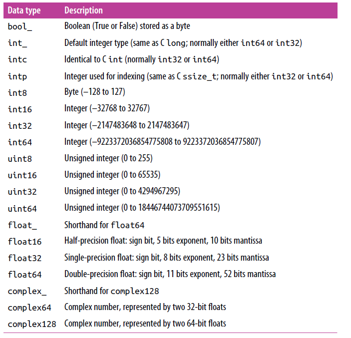
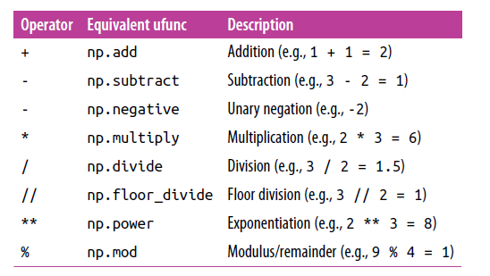
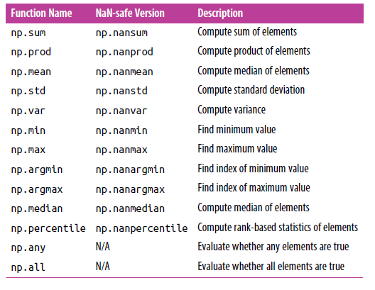

<font color="red" size="5px" >Note that: Learning book <i>Python Data Science Handbook</i></font>

Numpy 是一个数据科学计算库，主要用于对数组或矩阵的操作，提供了高效的计算方法。  
快速学习Numpy从以下几个方面进行开始：

* [如何创建数组](#np-create 'id值只能包含数字')
* [Numpy数组的属性](#np-property)
* [如何访问数组中的元素](#np-access)
* [如何获取数组的子数组(subarray)](#np-subarray)
* [如何对数组进行变形、合并和分割](#np-manipulation)
* [如何高效的计算重复元素:Universal Functions(ufuncs)](#np-ufuncs)
* [Numpy数组的聚合(Aggregations)操作](#np-aggregation)
* [广播(Broadcasting)](#np-broadcast)
* [排序(Sorting)](#np-sorting)
* [复杂数据类型:结构化数据(Structured Data)](#np-structure-data)

# <span id="np-create">如何创建数组</span>

## 从Python的list创建

> Note： 首先，你应该导入numpy包，`import numpy as np`  如果还未安装请使用`pip install numpy`或者`conda install numpy`进行安装.  

示例1：使用list创建数组

```python
lst = list(1,2,3,4,5,6)
np_arr = np.array(lst)
```

在创建`numpy`数组时可以指定数组的类型。见示例2.  
示例2：指定数据类型的创建

```python
np.array([1,2,3,4,5],dtype='float32')
np.array([1,2,3,4,5],dtype=float)
# nested lists result in multidimensional arrays
np.array([range(i, i + 3) for i in [2, 4, 6]])
```

关于`numpy`的数据类型可支持的包括：

<!--  -->


从`numpy`中自带的一些方法来创建数组，这些方法比较的常用：  

```python
# Create a length-10 integer array filled with zeros
np.zeros(10, dtype=int)
# out: array([0, 0, 0, 0, 0, 0, 0, 0, 0, 0])

# Create a 3x5 floating-point array filled with 1s
np.ones((3, 5), dtype=float)
# out:
# array([[ 1., 1., 1., 1., 1.],
#        [ 1., 1., 1., 1., 1.],
#        [ 1., 1., 1., 1., 1.]])

# Create a 3x5 array filled with 3.14
np.full((3, 5), 3.14)
# out:
# array([[ 3.14, 3.14, 3.14, 3.14, 3.14],
#        [ 3.14, 3.14, 3.14, 3.14, 3.14],
#        [ 3.14, 3.14, 3.14, 3.14, 3.14]])

# Create an array filled with a linear sequence
# Starting at 0, ending at 20, stepping by 2
# (this is similar to the built-in range() function)
np.arange(0, 20, 2)
# out: array([ 0, 2, 4, 6, 8, 10, 12, 14, 16, 18])

# Create an array of five values evenly spaced between 0 and 1
np.linspace(0, 1, 5)
# out: array([ 0. , 0.25, 0.5 , 0.75, 1. ])

# Create a 3x3 array of uniformly distributed
# random values between 0 and 1
np.random.random((3, 3))
# out:
# array([[ 0.99844933, 0.52183819, 0.22421193],
#        [ 0.08007488, 0.45429293, 0.20941444],
#        [ 0.14360941, 0.96910973, 0.946117 ]])

# Create a 3x3 array of normally distributed random values
# with mean 0 and standard deviation 1
np.random.normal(0, 1, (3, 3))
# out:
# array([[ 1.51772646, 0.39614948, -0.10634696],
#        [ 0.25671348, 0.00732722, 0.37783601],
#        [ 0.68446945, 0.15926039, -0.70744073]])

# Create a 3x3 array of random integers in the interval [0, 10)
np.random.randint(0, 10, (3, 3))
# out :
# array([[2, 3, 4],
#        [5, 7, 8],
#        [0, 5, 0]])

# Create a 3x3 identity matrix
np.eye(3)
# out:
# array([[ 1., 0., 0.],
#        [ 0., 1., 0.],
#        [ 0., 0., 1.]])

# Create an uninitialized array of three integers
# The values will be whatever happens to already exist at that
# memory location
np.empty(3)
# out : array([ 1., 1., 1.])
```

本小结主要说明如何创建`numpy`数组，难度系数比较低，操作比较简单。因此多以api为主。

# <span id="np-property">Numpy数组的属性</span>

在`numpy`数组中有一些通用属性，这些通用的属性对所有的数组都是有效的。参见示例3.  
示例3：`numpy`中数组的属性访问

```python
import numpy as np
np.random.seed(0) # seed for reproducibility
x1 = np.random.randint(10, size=6) # One-dimensional array
x2 = np.random.randint(10, size=(3, 4)) # Two-dimensional array
x3 = np.random.randint(10, size=(3, 4, 5)) # Three-dimensional array

# Each array has attributes ndim ,shape,size,dtype,itemsize,nbytes,
print("x3 ndim: ", x3.ndim)
print("x3 shape:", x3.shape)
print("x3 size: ", x3.size)
print("dtype:", x3.dtype)
print("itemsize:", x3.itemsize, "bytes")
print("nbytes:", x3.nbytes, "bytes")

# x3 ndim:  3
# x3 shape: (3, 4, 5)
# x3 size:  60
# dtype: int32
# itemsize: 4 bytes
# nbytes: 240 bytes

```  

以上的这些属性用的可能比较的多.

# <span id="np-access">如何访问数组中的元素</span>  

数组的访问与python中列表的访问方法类似，但是`numpy`自身也有独特的访问方式。  

数组中的访问下标无论时一维数组、二维数组还是多维数组，访问索引的起始索引从0开始。

* 对于一维数组而言，访问时从0开始，使用中括号(`[]`)的形式访问索引位置的元素.
* 对于二维数组而言，同样采用中括号(`[]`)的形式来访问，不过由于是二维的需要行索引和列索引来指定元素具体的位置信息，形如(`[row_idx,col_idx]`)。其中的行索引和列索引都是从0开始。  

示例：数组的访问

```python
import numpy as np
np.random.seed(0) # seed for reproducibility
x1 = np.random.randint(10, size=6) # One-dimensional array
x2 = np.random.randint(10, size=(3, 4)) # Two-dimensional array
x3 = np.random.randint(10, size=(3, 4, 5)) # Three-dimensional array

x1[0]
# out : 5
x1[4]
# out : 7

x2[0,0]
# out : 3
x2[2,0]
# out : 1

```

此外索引可以使用负号(`negative indices`)。在索引中使用负号意味着元素的索引从末尾开始向开始位置进行搜索，此时从末尾开始的索引编号从1开始。

```python
import numpy as np
np.random.seed(0) # seed for reproducibility
x1 = np.random.randint(10, size=6) # One-dimensional array
x2 = np.random.randint(10, size=(3, 4)) # Two-dimensional array
x3 = np.random.randint(10, size=(3, 4, 5)) # Three-dimensional array

x1[-1]
# out : 9
x1[-2]
# out : 7

x2[2, -1]
# out : 7

```

此外使用这种方式还可以对指定元素位置进行赋值。

```python

import numpy as np
np.random.seed(0) # seed for reproducibility
x1 = np.random.randint(10, size=6) # One-dimensional array
x2 = np.random.randint(10, size=(3, 4)) # Two-dimensional array
x3 = np.random.randint(10, size=(3, 4, 5)) # Three-dimensional array

x2[0,0]=12

x1[0]=3.14 # this will be truncated!

```

需要注意的是，`numpy`数组是一种固定类型即数组元素的数据类型是一致的。在进行赋值时，如果类型不匹配会强制转换为目标类型，否则产生异常。  

小结：本小结主要是从数组中读取元素的方式，一般采用中括号+元素索引的方式进行访问。另外这种方式也可以对指定位置的元素进行值更新即重新赋值。需要注意赋值时尽可能的保证赋值的数据类型保持一致。

# <span id="np-subarray">如何获取数组的子数组(subarray)</span>

在上小结当中通过中括号+索引的方式访问元素时仅能获取一个元素，如果要获取多个元素这种方式不太适用。另外一种读取数组的方式是采用`分片`.数组的分片与python中list的分片非常的相似。其基本语法为：

<center> <pre>x[start:end:step]</pre></center>

其中：x为数组名称，start 为切片的起始位置，end 为切片的结束位置，step 为从start位置开始到end结束，中间以step进行创建一个序列。那么在数组读取时按照序列的索引进行读取。切片读取也可以被称之为读取子数组。每次使用切片时只获取了满足条件的部分数组元素。对于这三个参数如果不指定的话将采用默认值，其中 start =0 ， stop= 维度的大小，step=1.注意的是在end位置的元素不会被读取即[start,end).

``` python
import numpy as np
x=np.arange(10)
# out : array([0, 1, 2, 3, 4, 5, 6, 7, 8, 9])
x[:5] # start default is 1 and step default is 1
# out : array([0, 1, 2, 3, 4])

x[5:] # end default is 10 and step default is 1
# out : array([5, 6, 7, 8, 9])

x[4:7] # step default is 1 ,the index 7 is exclued
# out : array([4, 5, 6])

x[::2] # start and end is default
# out : array([0, 2, 4, 6, 8])

x[1::2] # end is default 10
# out : array([1, 3, 5, 7, 9])

```

同样地，切片的步长也可以为负值，这种情形下不太容易理解，这种情形了可以表示为数组的索引从末尾开始向起始位置进行读取。结合一些案例理解会更加容易：

```python
import numpy as np
x=np.arange(10)

x[::-1] # start is default 0 and end is default 10 ,step is default -1
# out : array([9, 8, 7, 6, 5, 4, 3, 2, 1, 0])

```

这种写法相当于将一维数组做了一个反转，根据默认的start=0 和 end=10 ，step= -1，计算得到的索引序列为：`[-1，-2,-3,-4,-5,-6,-7,-8,-9,-10]` ，带有负值的索引从末尾开始访问.再来看一组：

```python
import numpy as np
x=np.arange(10)
x[5::-2] # start is 5  and end is default 10 ,step is -2

# out : array([5, 3, 1])

```

分析如下，由于start=5 和 end =10 , step = -2. 计算得到的索引序列为：`[-5,-7,-9]` 。  

由此可以总结得到计算方法为: start 和 end 按照 step 进行递增序列增加，如果步长为负，则在序列前面加上负号，否则保持原序列读取。  

多维数组的读取方式与一维数组切片读取的方式类似，每个切片的应用方式只针对每一维度即每一个axis。  

```python
import numpy as np

x2= np.array([[12, 5, 2, 4],
              [ 7, 6, 8, 8],
              [ 1, 6, 7, 7]])

x2[:2, :3] # row slice and col slice
# out ：  
# array([[12, 5, 2],
#        [ 7, 6, 8]])

x2[:3, ::2]
# out :  
# array([[12, 2],
#        [ 7, 8],
#        [ 1, 7]])

x2[::-1, ::-1]
# out : array([[ 7, 7, 6, 1],
#              [ 8, 8, 6, 7],
#              [ 4, 2, 5, 12]])

x2[:,0] # first column of x2
# out : [12 7 1]

x2[0,:]  # first row of x2
# out : [12 5 2 4]

x2[0] # equivalent to x2[0, :]
# out : [12 5 2 4]

```

注意上面在二维数组访问时，如果获取单独一行或者一列数据的方式，这种方式相当于将切片操作与单位置索引结合在一起使用。另外步长为负值的情形的也是要先计算每一个axis的序列然后在组合成二维数组元素点坐标。  

<font color="red">注意事项：</font> 采用切片这种方式获取得到的子数组时原来数组的视图，如果对子数组进行赋值操作也将会该动原数组的元素值。`numpy`这样设计的目的时为了避免大数组操作时耗时且效率低下问题，这也体现了`numpy`在数组计算方面效率高的另一个原因。如果对于小数据数组，如果是重新创建一个新的数组将不会消耗很大时间和内存，如果是一个大数据数组，那么重新创建数组分配内存时需要耗时且占据了大量的内存空间，这对于内存而言是一个很大消耗。如果确实需要创建一个额外的数组而不是视图，则可采用`copy`模块的copy方法重新创建一个新的数组。

# <span id="np-manipulation">如何对数组进行变形、合并和分割</span>  

* 数组reshape操作
  + 对数组的另一个有用的操作时对数组进行变形(reshape)，对数组变形只需要调用数组的`reshape`方法，指定目标数组的shape大小即可，不过需要注意的是目标变形的数组的元素个数与原数组元素的个数保持一致，否则产生异常。通过`reshape`方法得到的数组仍旧是原数组的视图。
  + 对于一维数组而言，如果想要将这个一维数组变为行矩阵或列矩阵，一种比较方便的方式是使用`np.newaxis`来表示一个slice操作。

示例：

```python
grid = np.arange(1, 10).reshape((3, 3))
print(grid)
[[1 2 3]
[4 5 6]
[7 8 9]]

x = np.array([1, 2, 3])
# row vector via reshape
x.reshape((1, 3))

# row vector via newaxis
x[np.newaxis, :]

# out : array([[1, 2, 3]])

# column vector via reshape
x.reshape((3, 1))

# column vector via newaxis
x[:, np.newaxis]

# out :  
# array([[1],
#       [2],
#       [3]])

```

* 数组合并(Concatenation)  
  数组的合并是将两个数组进行合并成为一个数组，可以用在一维数组、二维数组和多维数组。数组合并的方法主要有:`np.concatenate, np.vstack, , np.hstack and np.dstack` .对于方法`np.concatenate`而言，可以使用列表或者元组作为它的第一个参数，第一个参数列表或者元组的个数至少为2个。对于二维数组以上进行合并时可以指定`axis`,其默认的轴为0，此时按照指定的`axis`方向进行合并。这个方法仅使用与维度相同时合并，如果维度不同时使用另外的两种方法。
  示例：

```python

x = np.array([1, 2, 3])
y = np.array([3, 2, 1])
np.concatenate([x, y])
# out:  array([1, 2, 3, 3, 2, 1])

z = [99, 99, 99]
np.concatenate((x,y,z))
# out:  [ 1 2 3 3 2 1 99 99 99]

grid = np.array([[1, 2, 3],
                 [4, 5, 6]])
# concatenate along the first axis
np.concatenate([grid, grid])
# out:  
# array([[1, 2, 3],
#        [4, 5, 6],
#        [1, 2, 3],
#        [4, 5, 6]])

np.concatenate([grid, grid], axis=1)
# out:  array([[1, 2, 3, 1, 2, 3],
#              [4, 5, 6, 4, 5, 6]])

x = np.array([1, 2, 3])
grid = np.array([[9, 8, 7],
                 [6, 5, 4]])
# vertically stack the arrays
np.vstack([x, grid])
# out:  array([[1, 2, 3],
#              [9, 8, 7],
#              [6, 5, 4]])

# horizontally stack the arrays
y = np.array([[99],
              [99]])
np.hstack([grid, y])
# out: array([[ 9, 8, 7, 99],
#             [ 6, 5, 4, 99]])

```

数组的合并相对而言比较的简单，提供了不同形式的合并

* 数组的拆分
  与数组的合并操作相反，将一个数组拆分不同的子数组。拆分操作同样的适用于一维数组、二维数组和多维数组.主要用的方法有：`np.split, np.hsplit,np.vsplit and np.dsplit`.每个方法都对应了合并操作时的方法，其功能用法都比较的类似，因此仅以api展示为主.  
  示例：

```python

# one-dim

x = [1, 2, 3, 99, 99, 3, 2, 1]
x1, x2, x3 = np.split(x, [3, 5])
print(x1,x2,x3)
# out:  [1 2 3] [99 99] [3 2 1]

# two-dim
grid = np.arange(16).reshape((4, 4))
upper, lower = np.vsplit(grid, [2])
print(upper)
# out:  [[0 1 2 3]
#         [4 5 6 7]]

print(lower)
# out :  [[ 8 9 10 11]
          [12 13 14 15]]

left, right = np.hsplit(grid, [2])
print(left)
# out :  [[ 0 1]
#         [ 4 5]
#         [ 8 9]
#         [12 13]]

print(right)
# out:  [[ 2 3]
#        [ 6 7]
#        [10 11]
#        [14 15]]

```

需要注意的是，`np.split`第一个参数为待切分的数组，第二个参数为切分点，切分点指的是数组中索引的位置。对于`N`个切分点而言，切分数组后将产生`N+1`个子数组。这对于其余两种的方法也同样使用。  

小结：本结主要是为了说明对数组的变形操作，可以对数组进行形状变化，在重新进行对数组变形时需要注意变形前后数组元素个数必须保持一致，否则将产生异常错误。数组的拆分和合并是一对互操作，学会使用api即可。

# <span id="np-ufuncs">如何高效的计算重复元素:Universal Functions(ufuncs)</span>

Universal Functions 实现了一系列的数组向量化的操作*vectorized*,在计算`numpy`数组时如果采用`ufuncs`那么计算速度会非常快。我们可以和python的loop语句进行对比：  
示例：采用loop方式

```python
import numpy as np
np.random.seed(0)
def compute_reciprocals(values):
    output = np.empty(len(values))
        for i in range(len(values)):
            output[i] = 1.0 / values[i]
    return output

values = np.random.randint(1, 10, size=5)
compute_reciprocals(values)

big_array = np.random.randint(1, 100, size=1000000)
%timeit compute_reciprocals(big_array)  
#  1 loop, best of 3: 2.91 s per loop

```

示例2：采用Numpy的ufuncs

```python

%timeit (1.0 / big_array)
#  100 loops, best of 3: 4.6 ms per loop
```

从时间对比上，`numpy`的ufuncs的使用时间比loop方式得到了很大的提升。相对于动态类型的操作，`numpy`提供了一种比较便利的方式来处理静态数据,在进行处理时采用向量化(*vectorized*)方式进行计算,向量化操作在执行比较简单的计算时会对每个元素进行操作。更重要的是采用这种向量化的操作方式也需要循环的对每个元素进行计算，只是这个操作被放在了`numpy`的编译层，致使后期的执行速度非常的快。而loop操作需要不断循环的从内存中取元素以至于计算速度比较的慢。  

使用`ufuncs`的操作主要有两种: <i>Ufuncs exist in two flavors: unary ufuncs, which operate on a single input, and binary
ufuncs, which operate on two inputs.</i>.  

下列列表展示了`ufuncs`常用的操作:  



小结：关于`ufuncs`最重要的是理解数组向量化操作，向量化操作与loop操作相比在计算时能够大幅度的提升计算效率。关于更多的向量化操作请参考`numpy`的官方的[文档](https://docs.scipy.org/doc/numpy-1.15.4/reference/ufuncs.html#ufunc "ufuncs").关于`ufuncs`还需要额外的注意几个地方：(1)  指定输出数组。在进行大规模的数据计算时可能需要将计算的结果进行存储，而不是创建一个临时的数组。`nfuncs`提供了一个参数`out`可以将计算结果直接输出到你已经创建好的数组当中。

# <span id="np-aggregation">Numpy数组的聚合(Aggregations)操作</span>

数组的聚合能够为数组的统计特征提供很大帮助，对于一个大数据集而言，从最大值、最小值、四分位数等能够大概了解数据集的分布特征，`numpy`数组提供了很多的方法来计算这些聚合特征参数，而且这些方式的计算效率是高效的。  
聚合操作对一维数组、二维数组和多维数组都是有效的。另外数组对象可以直接调用聚合参数或者采用`np`来调用.聚合函数还有一个额外的参数`axis`来指定在哪个轴上进行计算。`axis=0`表示在行上计算. `axis=1`表示在列上计算.  
示例：

```python
x=np.random.random(100)

x.sum()
# 55.612091166049424
np.sum(x)
# 55.612091166049424

M = np.random.random((3, 4))

M.min(axis=0)
M.max(axis=1)

```

下面的列表列举了常用的聚合操作函数:  


小结：数组的聚合操作主要用于对数组的统计，通过数组的统计能够快速的了解数组的分布特征或计算其他可用指标。

# <span id="np-broadcast">广播(Broadcasting)</span>

# <span id="np-sorting">排序(Sorting)</span>

# <span id="np-structure-data">复杂数据类型:结构化数据(Structured Data)</span>
